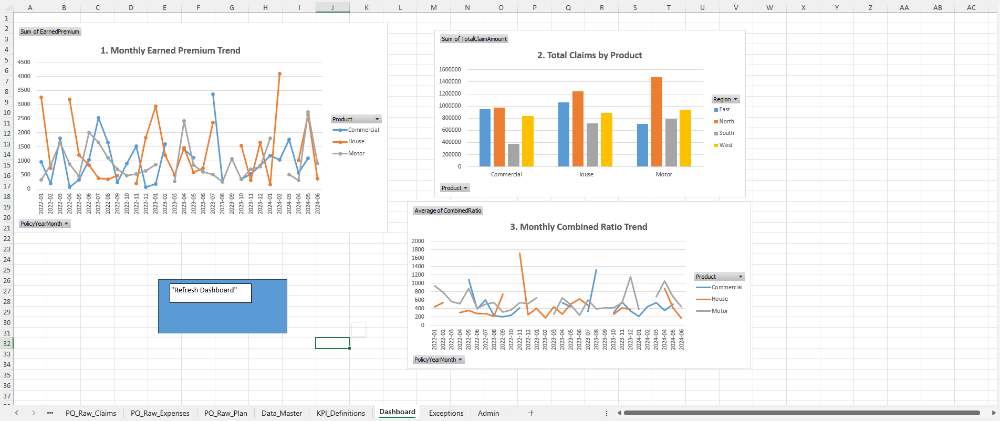

# Insurance Reporting Excel Project

This project demonstrates Excel-based reporting for insurance KPIs using **Power Query**, **Pivot Tables**, and **VBA automation**. It is a self-contained example of controlling and reporting in the insurance/finance domain, suitable for showcasing Excel, Power Query, and KPI analytics skills.

---

## Repository Structure

- **Insurance-Reporting-Excel.xlsm** → Main workbook containing all data queries, pivots, charts, and VBA macros.
- **data_raw/** → Folder with raw input Excel files:
  - policies.xlsx
  - claims.xlsx
  - expenses.xlsx
  - plan.xlsx
## Dashboard Preview

Below is the main dashboard showing monthly and product KPIs, including Earned Premium, Total Claims, and Combined Ratio.

> Note: For this project, all files are **synthetic datasets** for demonstration purposes.

---

## KPIs Included

The project calculates the following KPIs:

| KPI Name        | Formula                                  | Description                                      | Source Fields                  |
|-----------------|------------------------------------------|--------------------------------------------------|--------------------------------|
| Earned Premium  | PremiumAnnual / 12                        | Monthly premium earned for the policy            | PremiumAnnual                  |
| Total Claim Amount | SUM(ClaimAmount)                        | Total cost of claims in the period              | TotalClaimAmount               |
| Expense Amount  | ExpenseAmount                             | Monthly operating expenses                        | ExpenseAmount                  |
| Claim Count     | COUNT(ClaimID)                            | Number of claims in the period                   | ClaimCount                     |
| Loss Ratio      | TotalClaimAmount / EarnedPremium         | Measures underwriting profitability vs claims   | TotalClaimAmount, EarnedPremium|
| Expense Ratio   | ExpenseAmount / EarnedPremium            | Measures operating efficiency                    | ExpenseAmount, EarnedPremium   |
| Combined Ratio  | (TotalClaimAmount + ExpenseAmount) / EarnedPremium | Overall underwriting performance | TotalClaimAmount, ExpenseAmount, EarnedPremium |

### Aggregation Rules

| Column Name        | Aggregation Method | Resulting Field Name      | Description |
|--------------------|------------------|---------------------------|-------------|
| ClaimAmount        | Sum               | TotalClaimAmount          | Total amount paid for claims in the period |
| ReserveAmount      | Sum               | TotalReserveAmount        | Total outstanding reserves for claims in the period |
| ClaimID            | Count             | ClaimCount                | Number of claims opened/active in the period |

---

## Instructions

1. **Download the Excel workbook** (`Insurance-Reporting-Excel.xlsm`) and the `data_raw/` folder.  
2. **Unblock the file** if macros do not run:
   - Right-click → Properties → Check **Unblock** → OK.  
3. Open the workbook in Excel and click **Enable Content** when prompted.  
4. Use the **Refresh Dashboard** button on the Dashboard sheet to update all queries, pivot tables, and charts.
5. 
---

## Dashboard

- **Dashboard sheet** contains:
  - Monthly earned premium trend (line chart)
  - Total claims by product (column chart)
  - Monthly combined ratio trend (line chart)
---

## 📊 Analytical Insights

This workbook is engineered as a professional **Insurance Controlling & Steering Tool**, moving beyond static data to dynamic financial analysis.

* **VBA-Powered Automation:**
    * Implemented **VBA Macros** to automate data processing and report generation, significantly reducing manual effort and minimizing human error in monthly closing cycles.
* **Relational Data Management:**
    * Utilized **Excel Tables and Named Ranges** to create a scalable data structure. The project manages high-volume claims and premium data across 10+ relational modules.
* **Multi-Dimensional Variance Analysis:**
    * Leveraged **Pivot Caches** and Slicers to allow stakeholders to perform real-time "drill-downs" into Loss Ratios, comparing Year-to-Date (YTD) performance against Budgeted KPIs across different regions.
* **KPI Dashboarding:**
    * Designed an executive-level dashboard that visualizes the **Claims-to-Premium ratio**, helping identify specific product lines that require underwriting adjustments.

---

## 🚀 Future Roadmap

To transition this tool into a fully automated Business Intelligence (BI) suite:

1. **Power Query (M) Integration:** Replace manual data imports with a direct ETL pipeline to handle external `.csv` or `.sql` data sources automatically.
2. **Predictive Trend Analysis:** Integrate Excel’s **Data Analysis Toolpak** to include seasonal forecasting for premium growth and claims development.
3. **Advanced Scenario Manager:** Build a dedicated "What-If" simulation tab using VBA to model the impact of catastrophic events or inflation on the net loss reserve.
4. **Power Pivot & DAX:** Implement Data Analysis Expressions (DAX) to create more complex measures, such as "Rolling 12-Month Loss Ratios" and "Earned vs. Written Premium" logic.

---

## Notes

- The workbook is fully **macro-enabled** (.xlsm).  
- All data is **synthetic**; no real client data is used.  
- Designed to demonstrate **Excel automation, Power Query, pivot-based reporting, and KPI calculation**.  

---

## License

This project is for **educational and portfolio purposes**. Feel free to use and adapt for learning.
